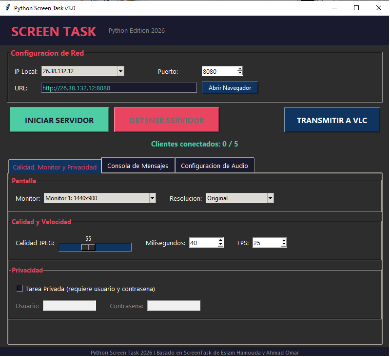
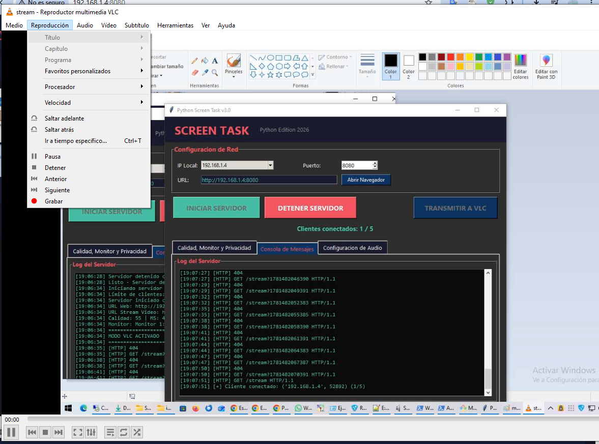
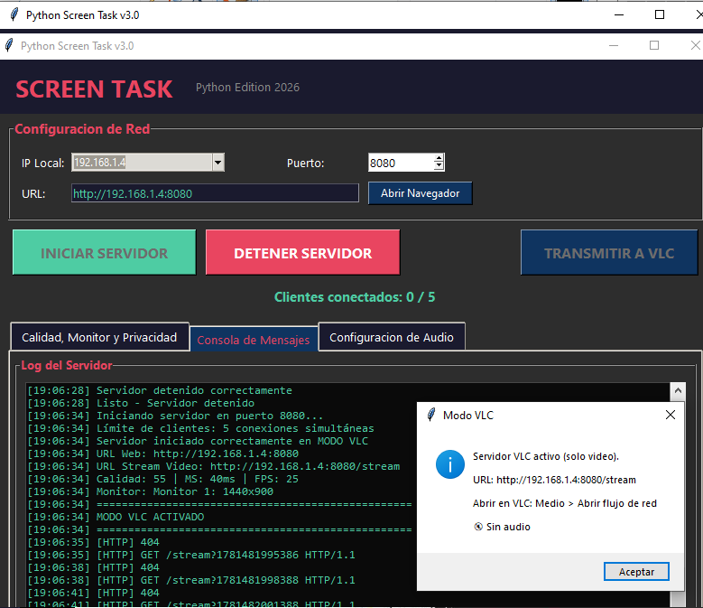

# 📺 Python Screen Task


---

# 🎯 Objetivo

**Python Screen Task** es una aplicación de escritorio desarrollada en Python que permite compartir la pantalla de un equipo dentro de una red local sin necesidad de utilizar servicios en la nube o conexión a Internet.

El proyecto incorpora transmisión de video en tiempo real mediante MJPEG y soporte para transmisión multimedia compatible con VLC.

---

# ✨ Características principales

* 🖥️ Captura de pantalla en tiempo real.
* 🖥️ Soporte para múltiples monitores.
* 🌐 Interfaz web responsive accesible desde cualquier navegador.
* 📡 Streaming MJPEG para dispositivos de la red local.
* 🔒 Modo privado mediante autenticación HTTP Basic.
* ⚙️ Configuración de resolución, FPS y calidad JPEG.
* 🎵 Preparado para integración de audio del sistema.
* 🏠 Funcionamiento completamente local (LAN/WiFi).

---

# 📸 Vista previa



*Interfaz principal de configuración.*



*Pantalla de instrucciones para reproducción mediante VLC.*



*Streaming abierto desde VLC.*

---

# 📦 Requisitos

## Sistema Operativo

| Sistema | Versión |
| ------- | ------- |
| Windows | 10 / 11 |

## Dependencias Python

```txt
pyautogui>=0.9.54
mss>=9.0.1
Pillow>=10.0.0
PyAudioWPatch>=0.2.12.6
pydub>=0.25.1
```

## Software recomendado

| Software         | Uso                      |
| ---------------- | ------------------------ |
| FFmpeg           | Procesamiento multimedia |
| VLC Media Player | Recepción del streaming  |
| Python 3.10+     | Ejecución del proyecto   |

### Instalación rápida de FFmpeg

```powershell
winget install ffmpeg
```

---

# 🚀 Instalación

## Clonar repositorio

```bash
git clone https://github.com/lgona/ScreenTask.git

cd ScreenTask
```

## Crear entorno virtual

```bash
python -m venv venv
```

### Windows

```bash
.\venv\Scripts\activate
```

## Instalar dependencias

```bash
pip install -r requirements.txt
```

---

# ▶️ Ejecución

```bash
screen_task_gui_final_with_AUDIO_2 - BETA.py
```
*eliminar espacios*
---

# 🌐 Uso del Streaming

## Modo Web (Video)

1. Abrir la pestaña:

   * Calidad
   * Monitor
   * Privacidad

2. Configurar:

   * Resolución
   * Calidad JPEG
   * FPS

3. Presionar:

```text
INICIAR SERVIDOR
```

4. Abrir la URL mostrada:

```text
http://192.168.1.4:8080
```

---

## 📺 Modo VLC

1. Abrir VLC.
2. Ir a:

```text
Medio → Abrir flujo de red
```

3. Introducir:

### Video

```text
http://IP_DEL_SERVIDOR:8080/stream
```

### Video + Audio (Próximamente)

```text
http://IP_DEL_SERVIDOR:8080/stream.ts
```

---

# 🔐 Acceso privado

Para restringir el acceso:

1. Activar **Tarea Privada**.
2. Definir:

   * Usuario
   * Contraseña

Los clientes deberán autenticarse para visualizar el contenido.

---

# 📥 Descargas

La versión compilada para Windows se encuentra disponible dentro de la carpeta:

```text
/dist/ScreenTaskPy.exe
```

No es necesario instalar Python para ejecutar dicha versión.

---

# 🖥️ Compatibilidad

Actualmente:

✅ Windows 10

✅ Windows 11

### Futuras versiones

El proyecto ha sido desarrollado en Python, por lo que puede extenderse a otros sistemas operativos como:

* Linux
* Ubuntu
* Debian
* Fedora

La adaptación requerirá:

* Librerías equivalentes para captura de audio.
* Ajustes específicos de cada sistema operativo.
* Compilación de versiones nativas.

La interfaz actual puede reutilizarse sin necesidad de desarrollar una nueva.

---

# ⚠️ Errores conocidos y mejoras pendientes

## Error 1: Conexiones simultáneas

Actualmente existe una limitación en el manejo de múltiples clientes conectados al mismo tiempo.

### Pendiente

* Mejorar la gestión concurrente de conexiones.
* Optimizar el consumo de memoria.
* Incrementar el número de clientes simultáneos soportados.

---

## Error 2: Integración completa de audio

La transmisión de audio aún se encuentra en proceso de integración.

### Pendiente

* Incorporar audio del sistema en el streaming principal.
* Sincronización Audio/Video.
* Compatibilidad total con VLC.
* Soporte MPEG-TS estable.

---

# 🛠️ Solución de problemas

| Problema                 | Solución                             |
| ------------------------ | ------------------------------------ |
| FFmpeg no encontrado     | Instalar FFmpeg y agregarlo al PATH  |
| VLC no reproduce         | Verificar URL y firewall             |
| No se detecta audio      | Revisar dispositivo de salida WASAPI |
| No acceden otros equipos | Verificar reglas del firewall        |
| Alta latencia            | Reducir calidad JPEG o FPS           |

---

# 🔥 Configuración del Firewall

Para que otros dispositivos de la red local puedan acceder al servidor, es necesario permitir el acceso de la aplicación en el Firewall de Windows.

Al ejecutar la aplicación por primera vez, Windows puede mostrar una ventana solicitando permisos de acceso.

Se recomienda habilitar:

✅ Redes privadas

Opcional:

✅ Redes públicas

Si el acceso fue bloqueado, agregar manualmente la aplicación a las excepciones del Firewall.

---

# 🏷️ Versión

## Actual

**v3.0.0 (2026)**

### Historial

| Versión | Fecha | Descripción                                              |
| ------- | ----- | -------------------------------------------------------- |
| v3.0.0  | 2026  | Streaming multimedia, interfaz mejorada y optimizaciones |
| v2.0.0  | 2025  | Soporte multi-monitor y modo privado                     |
| v1.0.0  | 2024  | Captura básica MJPEG                                     |

---

# 🙏 Créditos

Basado en:

* ScreenTask Windows © Eslam Hamouda https://github.com/EslaMx7
* ScreenTask © Ahmad Omar https://github.com/ahmadomar

Adaptación y mejoras en Python orientadas a redes locales y streaming multimedia.
